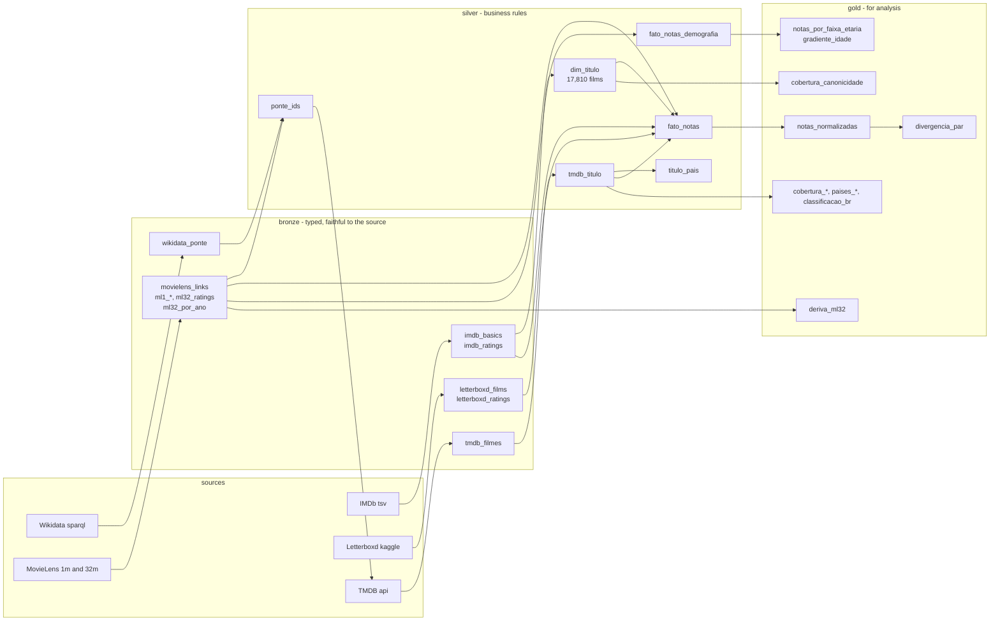
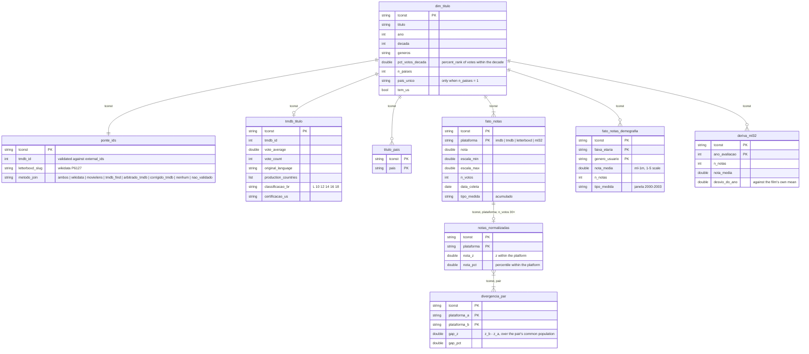

# Different Publics, Different Ratings - Who Rates What?

*Versão em português: [README.md](README.md).*

First deliverable of the Strategic Management of Information Technology course (EPS7008, UFSC/EPS). **Thesis:** audiences of different platforms rate the same works differently - the people giving a 10 on IMDb are not the people giving 5 stars on Letterboxd. The unit of analysis is the title; what we measure is the divergence between platforms, as the position of each film within its own platform's distribution, never mean against mean.

- **E1 (2026-09-15):** exploratory analysis. This repository is the engineering behind it.
- **E2 (2026-11-24):** dashboard, unsupervised ML, regression and classification. -- not implemented

Team: **José Eduardo Pereira, Amaury Philippot and Lucas Christian Harmodio Fraile**.

## If you are doing the analysis

1. The package lives in the shared Drive folder: **[eps7008-e1](https://drive.google.com/drive/folders/1bpF9ch74Zx7HU-kKWlJBBUzadIPrWFn7?usp=sharing)** (team only). Inside, `pacote-e1-2026-09-13/` has `silver/` (dimensions and facts), `gold/` (ready-made aggregates) and a one-page `README.md` with the data dictionary, the things not to do and seven suggested questions. The `.zip` next to it is the same content, for download.
2. Open the setup notebook in Colab: **[00-setup.ipynb](https://colab.research.google.com/drive/1B1ByQMrs4iGZEoBZv3WeCCYJVMmgMFks)** (the copy in `notebooks/` is identical). It mounts Drive, loads the tables as DuckDB views, shows the normalization pattern in code and one example chart. To work, save your own copy in the folder (File -> Save a copy in Drive) and leave `00-setup` as the reference.

   **Before running, once:** a shared folder shows up under "Shared with me", and Colab's `drive.mount` does not mount that, only "My Drive". In "Shared with me", right-click `eps7008-e1` -> Organize -> **Add shortcut to Drive** -> My Drive. With the shortcut, the path `/content/drive/MyDrive/eps7008-e1/pacote-e1-2026-09-13` used in the notebook works for everyone.
3. Read the package README before drawing any chart. The seven "don't" items are not style; they are what separates a result from an artifact.

The package is frozen: `gold/` can be regenerated, but the E1 numbers are the ones in that zip (tag `v0.1-e1-dados`).

Table and column names are in Portuguese. The short glossary:

| name | meaning |
|---|---|
| `tconst` | IMDb title id, the key everywhere |
| `titulo`, `titulo_original`, `ano`, `decada`, `duracao`, `generos` | title, original title, year, decade, runtime, genres |
| `pct_votos_decada` | percent rank of the film's IMDb votes within its decade (0 = least voted, 1 = most) |
| `n_paises`, `pais_unico`, `tem_us` | number of production countries, the country when there is exactly one, whether the US is among them |
| `plataforma`, `nota`, `escala_min`, `escala_max`, `n_votos` | platform, mean rating, scale bounds, number of votes |
| `data_coleta`, `tipo_medida` | collection date, `acumulado` (cumulative) or `janela` (window) |
| `faixa_etaria`, `genero_usuario`, `nota_media`, `n_notas` | age group, user gender, mean rating, number of ratings |
| `nota_z`, `nota_pct`, `gap_z`, `gap_pct` | z-score and percentile within the platform; their difference between two platforms |
| `ano_avaliacao`, `desvio_do_ano`, `desvio_no_filme` | year the rating was given; deviation of that year from the film's mean; deviation of an age group from the film's mean |
| `classificacao_br`, `certificacao_us` | Brazilian age rating (L, 10, 12, 14, 16, 18), US certification |

## Layout

```
datalake/          not in git (terms of use). landing -> bronze -> silver -> gold -> pacote
etl/               the pipeline in sql, one script per stage, logs next to them; run.sh runs everything
ops/               tooling: sql runner, tmdb crawler, source download, packager, tests
recon/             session 1: source reconnaissance (only aggregates are versioned)
docs/              session reports, sources, package README
notebooks/         colab setup
```

## Pipeline



Order: `bronze.sql -> processa_tmdb.py -> silver.sql -> silver_tmdb.sql -> silver_notas.sql -> gold.sql -> gold_tmdb.sql -> gold_notas.sql -> checks.py`. `etl/run.sh` does all of it in about 20 s (the TMDB crawl, 15 min, runs once and stays in `landing/tmdb`). Every script is idempotent and runs through `ops/run_sql.py`, which executes a `.sql` file in DuckDB statement by statement and prints whatever returns rows.

## Data model

The contract is `dim_titulo`; everything joins to it on `tconst` (the IMDb id). Ratings are stored long - a new platform is a new row - and normalization (z-score, percentile) only exists in gold, because it changes with the subset.



Full dictionary, column by column: `docs/README-tabelao.md` (Portuguese).

## Decisions baked into the data

- **Frame:** `titleType = movie`, 5,000+ IMDb votes, 1930-2023 -> 17,810 films. The vote cut selects different things in each decade (the elite in the 1930s, every average release in the 2010s); hence `pct_votos_decada` and decade comparisons within quartile.
- **Letterboxd -> IMDb bridge** through Wikidata (P6127 -> P345): 98.5% of the frame has a slug in the dump. Title+year matching was discarded.
- **`tmdb_id` validated** against `external_ids.imdb_id` on every row: 99.97%. In the 19 MovieLens x Wikidata disagreements, Wikidata was right 18 times and MovieLens 0.
- **Country:** no primary country. `pais_unico` is the clean stratum; co-production is its own category; `tem_us` separates "GB alone" from "GB with the US".
- **Dates:** IMDb and TMDB cumulative as of 2026-09-13, Letterboxd and ml-32m as of Oct 2023, ml-1m a 2000-2003 window. `tipo_medida` tells cumulative from window.
- **Engineering findings that are already results:** Letterboxd coverage is canonicity, not a defect; the ml-1m age gradient was basket composition; Letterboxd is the platform that drifts away from the others (z correlation 0.76-0.85 against 0.90-0.93 among the rest).

Reports, in order (Portuguese): `recon/relatorio.md` (sources and cut), `docs/ponte-wikidata.md` (bridge and frame), `docs/confundimento-tmdb.md` (canonicity and TMDB), `docs/fato-notas.md` (ratings and package).

## Reproduce from scratch

```bash
python -m venv ops/venv-gestao && ops/venv-gestao/bin/pip install -r ops/requirements.txt
ops/download_fontes.sh                          # ~5 gb into datalake/landing; kaggle needed no credential
etl/run.sh                                      # bronze and silver (~10 s); stops and asks for the crawl
cp .env.example .env                            # tmdb key: https://www.themoviedb.org/settings/api, you must register an app
ops/venv-gestao/bin/python ops/crawl_tmdb.py    # ~15 min, reads silver to know what to fetch
etl/run.sh                                      # now goes all the way to gold (~20 s) and ends with the 26 integrity checks
ops/empacotar.sh                                # datalake/pacote/pacote-e1-<date>.zip
```

`ops/teste_tmdb.py` exercises the crawler, the parser and the arbitration with a mocked API, without touching `datalake/`. Downloading the sources again changes the frame (IMDb, TMDB and Wikidata change daily); to reproduce the E1 numbers, use the frozen package.

## Data and licenses

No per-title data is in git: the whole `datalake/` is ignored and the only versioned parquets (`recon/`) are counts by vote band, decade and region. Sources, terms and citations in `docs/fontes.md`.

*This product uses the TMDB API but is not endorsed or certified by TMDB.* MovieLens: Harper & Konstan (2015), ACM TiiS 5(4). IMDb: non-commercial datasets. Letterboxd: freeth's dataset on Kaggle. Wikidata: CC0.
