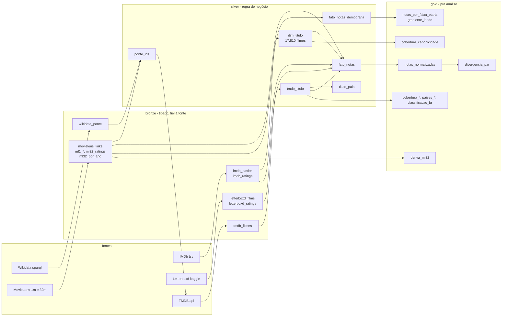
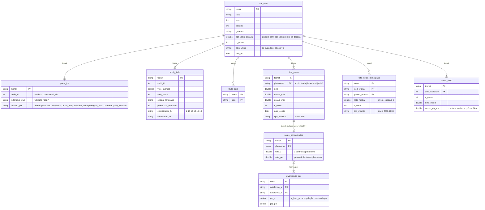

# Públicos diferentes, notas diferentes

*English version: [README.en.md](README.en.md).*

Primeira Entrega da disciplina de Gestão Estratégica da Tecnologia da Informação (EPS7008, UFSC/EPS). **Tese:** públicos de plataformas diferentes avaliam as mesmas obras de forma diferente - quem dá 10 no IMDb não é quem dá 5 estrelas no Letterboxd. A unidade de análise é o título; o que se mede é a divergência entre plataformas, na posição de cada filme dentro da distribuição da própria plataforma, nunca média contra média.

- **E1 (15/09/2026):** análise exploratória. Este repositório é a engenharia que a sustenta.
- **E2 (24/11/2026):** dashboard, ML não supervisionado, regressão e classificação. -- não implementado

Grupo: **José Eduardo Pereira, Amaury Philippot e Lucas Christian Harmodio Fraile**.

## Pra quem vai analisar

1. O pacote está na pasta compartilhada do Drive: **[eps7008-e1](https://drive.google.com/drive/folders/1bpF9ch74Zx7HU-kKWlJBBUzadIPrWFn7?usp=sharing)** (acesso só pro grupo). Dentro, `pacote-e1-2026-09-13/` tem `silver/` (dimensões e fatos), `gold/` (agregados prontos) e um `README.md` de uma página com o dicionário, o que não fazer e sete perguntas sugeridas. O `.zip` ao lado é a mesma coisa, pra quem quiser baixar.
2. Abre o notebook de setup no Colab: **[00-setup.ipynb](https://colab.research.google.com/drive/1B1ByQMrs4iGZEoBZv3WeCCYJVMmgMFks)** (a cópia em `notebooks/` é a mesma). Ele monta o Drive, carrega as tabelas como views do DuckDB, mostra o padrão de normalização em código e um gráfico de exemplo. Pra trabalhar, salva uma cópia sua na pasta (Arquivo -> Salvar uma cópia no Drive) e deixa o `00-setup` como referência.

   **Antes de rodar, uma vez só:** pasta compartilhada aparece em "Compartilhados comigo", e o `drive.mount` do Colab não monta isso, só o "Meu Drive". Em "Compartilhados comigo", botão direito na `eps7008-e1` -> Organizar -> **Adicionar atalho ao Drive** -> Meu Drive. Com o atalho, o caminho `/content/drive/MyDrive/eps7008-e1/pacote-e1-2026-09-13` que está no notebook funciona pra todo mundo.
3. Lê o README do pacote antes de qualquer gráfico. Os sete pontos de "não fazer" não são estilo, são o que separa resultado de artefato.

O pacote é congelado: o `gold/` pode ser regerado, mas os números da E1 são os desse zip (tag `v0.1-e1-dados`).

## Estrutura

```
datalake/          fora do git (termos de uso). landing -> bronze -> silver -> gold -> pacote
etl/               o pipeline em sql, um script por etapa, com os logs ao lado; run.sh roda tudo
ops/               ferramentas: runner de sql, crawler do tmdb, download das fontes, empacotador, testes
recon/             sessão 1: reconhecimento das fontes (só agregados versionados)
docs/              relatórios das sessões, fontes, README do pacote
notebooks/         setup pro colab
```

## Pipeline



Ordem: `bronze.sql -> processa_tmdb.py -> silver.sql -> silver_tmdb.sql -> silver_notas.sql -> gold.sql -> gold_tmdb.sql -> gold_notas.sql -> checks.py`. `etl/run.sh` faz isso em ~20 s (o crawl do TMDB, 15 min, roda uma vez e fica em `landing/tmdb`). Cada script é idempotente e roda com `ops/run_sql.py`, que executa um `.sql` no DuckDB statement a statement e imprime o que devolver linhas.

## Modelo de dados

O contrato é `dim_titulo`; tudo se junta a ele por `tconst` (id do IMDb). Notas ficam em formato longo - plataforma nova é linha nova - e a normalização (z-score, percentil) só existe no gold, porque muda com o recorte.



Dicionário completo, coluna a coluna: `docs/README-tabelao.md`.

## Decisões que estão nos dados

- **Frame:** `titleType = movie`, 5.000+ votos no IMDb, 1930-2023 -> 17.810 filmes. O corte de votos seleciona coisas diferentes em cada década (a elite nos anos 1930, todo lançamento mediano nos 2010); por isso `pct_votos_decada` e a comparação entre décadas dentro de quartil.
- **Ponte Letterboxd -> IMDb** pelo Wikidata (P6127 -> P345): 98,5% do frame com slug no dump. Título+ano foi descartado.
- **`tmdb_id` validado** contra `external_ids.imdb_id` em todas as linhas: 99,97%. Nas 19 divergências MovieLens x Wikidata, o Wikidata acertou 18 e o MovieLens 0.
- **País:** sem país primário. `pais_unico` é o estrato limpo; coprodução é categoria própria; `tem_us` separa "GB sozinho" de "GB com os EUA".
- **Datas:** IMDb e TMDB acumulados de 13/09/2026, Letterboxd e ml-32m de out/2023, ml-1m janela 2000-2003. `tipo_medida` distingue acumulado de janela.
- **Achados de engenharia que já são resultado:** a cobertura do Letterboxd é canonicidade, não defeito; o gradiente de idade do ml-1m era composição da cesta; o Letterboxd é a plataforma que descola das outras (correlação de z 0,76-0,85 contra 0,90-0,93 entre as demais).

Relatórios, em ordem: `recon/relatorio.md` (fontes e corte), `docs/ponte-wikidata.md` (ponte e frame), `docs/confundimento-tmdb.md` (canonicidade e TMDB), `docs/fato-notas.md` (notas e pacote).

## Reproduzir do zero

```bash
python -m venv ops/venv-gestao && ops/venv-gestao/bin/pip install -r ops/requirements.txt
ops/download_fontes.sh                          # ~5 gb em datalake/landing; kaggle não precisou de credencial
etl/run.sh                                      # bronze e silver (~10 s); para e pede o crawl
cp .env.example .env                            # chave do tmdb: https://www.themoviedb.org/settings/api, é preciso registrar o app
ops/venv-gestao/bin/python ops/crawl_tmdb.py    # ~15 min, lê o silver pra saber o que buscar
etl/run.sh                                      # agora vai até o gold (~20 s) e termina nos 26 checks de integridade
ops/empacotar.sh                                # datalake/pacote/pacote-e1-<data>.zip
```

`ops/teste_tmdb.py` exercita crawler, parser e a arbitragem com a API mockada, sem tocar em `datalake/`. Baixar as fontes de novo muda o frame (IMDb, TMDB e Wikidata mudam todo dia); pra reproduzir os números da E1, usa o pacote congelado.

## Dados e licenças

Nenhum dado por título está no git: `datalake/` inteiro é ignorado e os únicos parquets versionados (`recon/`) são contagens por faixa, década e região. Fontes, termos e citações em `docs/fontes.md`.

*This product uses the TMDB API but is not endorsed or certified by TMDB.* MovieLens: Harper & Konstan (2015), ACM TiiS 5(4). IMDb: non-commercial datasets. Letterboxd: dataset de freeth no Kaggle. Wikidata: CC0.
